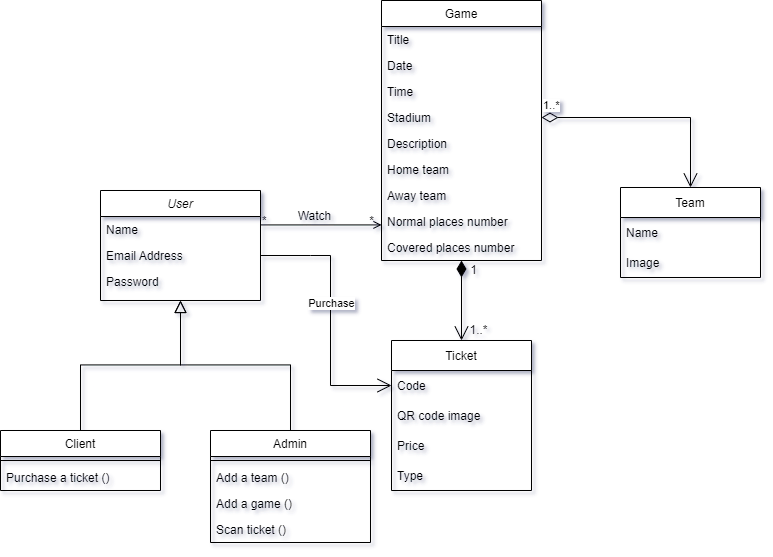

# insticket
## Online ticketing system
Final year project.

### Team

- Mohammed Hamidi

- Sidahmed Abdelaoui

- Abdou Ammar

- Mohammed Senouci

### Description

a solution for real-time ticket sales and access control at the level of football stadiums

2021/2022

## Tech Stack

**Client:** Flutter

**Server:** Fairebase

## Conception

### Class Diagram
[

### MLD
USER (uId, mail, password, name, isAdmin).
GAME (id, title, description, stadium, date, covered_place_number,
covered_place_current,covered_place_price , normal_place_number, normal_place_current,
covered_place_price, home_team#, away_team#).
TICKET (code, Qr_code, isValid, type, price, uId#, gameId#).
TEAM (name, img_url).
Game (*) --- (Watch) --- (*) User :
WATCH (uid#, match_id#)

## Try it

